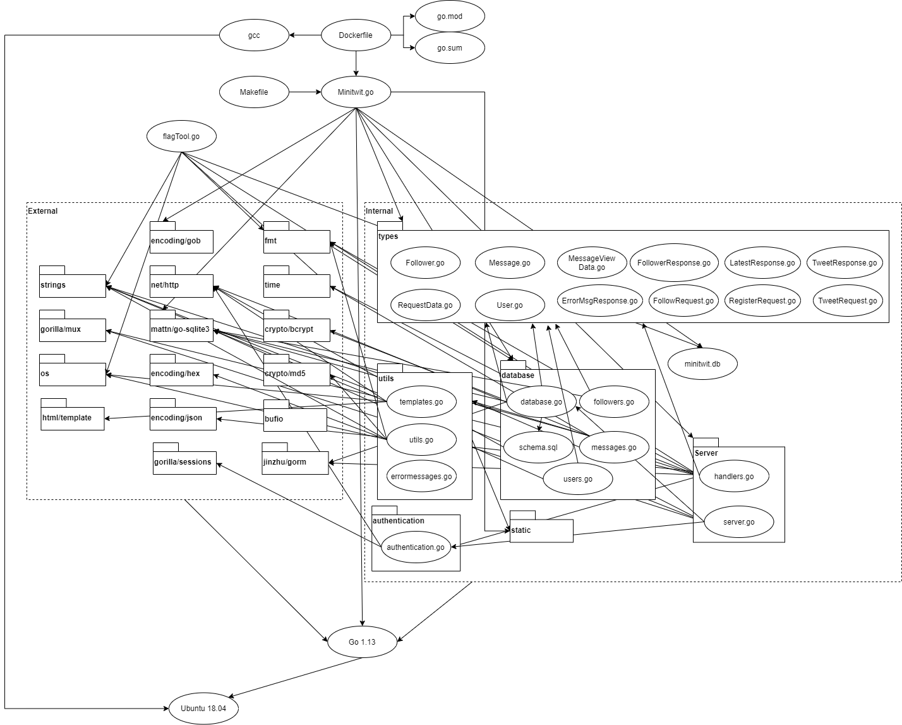

                        / MiniTwit /

    ~ What is MiniTwit?

      A SQLite and Gorilla powered twitter clone written in Golang

    ~ How do I use it?

      Use the Makefile to build and run the solution. Hence:

      make build && make start

      When up and running, the application will greet
      you on http://localhost:5000/

    ~ Is it tested?

      Yes, we have a fully functional automated test suite running.

---

Following commands should be run in the terminal:

To get the newest go version:

`sudo snap install --classic go`

To install all project dependencies:

`make install`

To build and run the project:
`make build && make start`

To add go as environment variable:
export PATH=\$PATH:/usr/local/go/bin

# deploy

The application is hosted on the following two ip(s):
178.128.249.71 (http://www.fuldsmadder.works)
142.93.238.65

The IP with a domain attached is our production environment, whereas the other one is our test.

To get access your public key needs to be uploadet to the servers. To login to the server:
`ssh root@178.128.249.71`
`ssh root@142.93.238.65`
Once on the server, the code can be found at:
`../var/www/devops`

The deployment is kept up to date, by our pipeline constructed in github actions.
When pushed to the develop branch, the pipeline deploys to our test environment, & when pushed to master, it deploys to our production environment.

---

